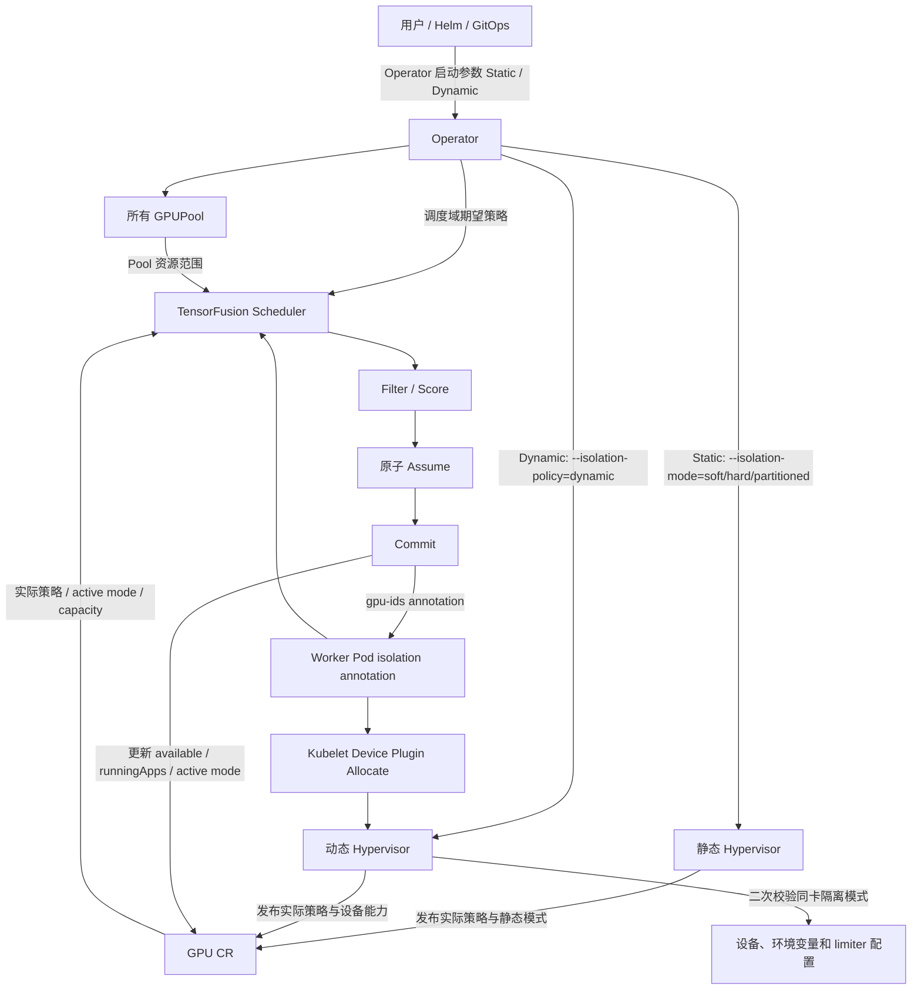
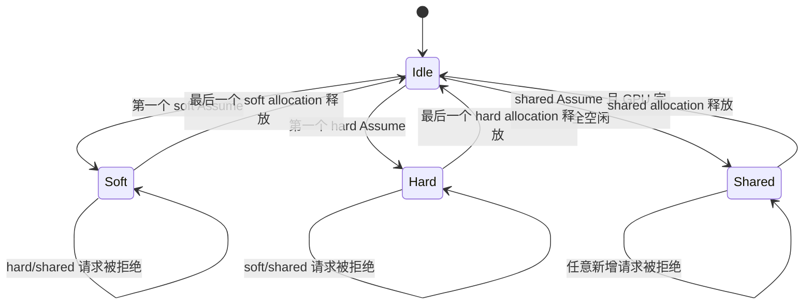

# 动态 GPU 隔离设计

## 1. 文档状态

- 状态：设计评审稿
- 目标版本：待定
- 适用范围：TensorFusion v2
- 本文只描述设计，不代表当前代码已经实现。

## 2. 背景

TensorFusion 当前使用 GPUPool 中的节点隔离配置预先确定节点运行模式：

```yaml
spec:
  nodeManagerConfig:
    defaultIsolationMode: soft
    isolationModeRules:
      - mode: hard
        selector:
          matchLabels:
            gpu-workload-class: hard
```

Operator 根据 Kubernetes Node labels 解析出节点的 `soft`、`hard` 或
`partitioned` 模式，并将结果作为 `--isolation-mode` 参数传给该节点的
Hypervisor。Hypervisor 再把同一个模式发布给节点上的所有 GPU。因此，虽然当前
`GPU.status.isolationMode` 位于 GPU CR 上，其实际来源仍是节点级静态配置。

这种方式适合提前规划资源池，但存在以下限制：

- soft 与 hard 必须在节点投入使用前划分好。
- 一个多卡节点无法同时让不同物理 GPU 分别承载 soft 和 hard workload。
- 节点的业务结构变化后，静态规划可能形成资源碎片。

本设计增加调度域级隔离策略。一套 TensorFusion Operator/Scheduler 管理的所有 GPUPool 统一
选择静态或动态模式：

- 静态模式维持现有行为。
- 动态模式不预先指定节点属于 soft 或 hard。
- 动态模式下，一张空闲 GPU 第一次被分配时，由该 Pod 的隔离类型锁定当前模式。
- 一张 GPU 在同一时刻只能服务一种隔离类型。
- 最后一个占用该 GPU 的 Pod 释放后，GPU 回到未锁定状态，可被另一种模式重新占用。

## 3. 目标与非目标

### 3.1 第一阶段目标

1. TensorFusion 集群在一个调度域内选择并启用一种隔离策略：`Static` 或 `Dynamic`。
2. 动态调度域支持 `soft`、`hard` 和 `shared` workload。
3. 同一动态节点上的不同 GPU 可以同时处于 soft、hard 或 shared 状态。
4. 同一 GPU 上只允许相同隔离类型的 Pod 共存；shared 始终独占整张空闲 GPU。
5. 模式选择、并发预占和释放必须在调度器中保持原子性。
6. Hypervisor 必须对设备插件分配进行二次校验，防止控制面状态异常导致跨模式混用。
7. Hypervisor 或 Operator 正常重启后，能够根据存量 Pod 恢复动态 GPU 状态。
8. Dynamic defrag 能在同一 isolation 类型内安全重排资源，并在失败时原子回滚。
9. 原生 device-plugin Pod 能与 TensorFusion Pod 在同一节点的不同 GPU 上安全共存；原生占用卡
   不会被动态调度。
10. 现有静态配置与旧对象升级后保持原行为。

v1→Dynamic 接管的前置条件：每个存量 Worker Pod 有有效的
`tensor-fusion.ai/gpu-ids` 和 `tensor-fusion.ai/isolation`；同一 GPU 恢复出的模式不能冲突；
不存在 partitioned/MIG 或无法确认的外部 GPU 占用。接管期间暂停新 allocation，Hypervisor 和
Scheduler 恢复完成后才开放调度。

当前版本不支持 Static 与 Dynamic GPUPool 在同一 TensorFusion 调度域内共存。首版使用 Operator
启动参数作为调度域级策略开关，降低 Operator、Scheduler 和 Hypervisor 同时维护两套状态语义的
复杂度。

### 3.2 第一阶段明确不支持

1. 动态调度域不支持 `partitioned`，包括 NVIDIA MIG 和其他厂商硬件切分。
2. 不支持带有无法恢复存量 allocation 的静态与动态策略无损在线切换；普通切换前必须清空整个
   调度域的 workload。满足上述条件的 v1 soft/hard 存量 Pod 走单独的 v1→Dynamic 接管流程，
   不要求删除业务 Pod。
3. 不支持跨隔离类型抢占，例如 hard Pod 通过抢占 soft Pod 将 GPU 从 soft 改成 hard。
4. 不改变现有 workload 运行限制，例如 hard local 模式仍需要当前支持的 sidecar 或 remote 路径。

动态调度域首版必须支持以下两项能力：

- Dynamic node compaction/defrag：只允许在不改变 workload isolation 的前提下迁移或重排 allocation；
  planner 必须维护每张 GPU 的 active mode、committed/assumed allocation 和外部设备占用，禁止把
  soft、hard、shared allocation 通过 defrag 合并到同一张卡。
- 原生 device-plugin Pod 共存：原生 Pod 可以和 TensorFusion Pod 位于同一动态节点的不同 GPU 上。
  被原生 Pod 占用的 GPU 必须作为外部独占 allocation 纳入状态，并从 TensorFusion 动态候选中排除；
  不能仅因为节点仍有其他空闲 GPU 就把该卡视为空闲动态 GPU。

### 3.3 后续可扩展项

- 跨模式抢占。
- 将隔离策略下沉到 GPUPool，支持同一调度域内 Static/Dynamic GPUPool 共存。
- 原生 device-plugin 与 TensorFusion allocation 的更细粒度共享（当前首版按整卡 external 保护）。
- 在硬件切分关闭、设备完全空闲时进行动态 MIG 模式转换。
- 有状态的静态/动态在线迁移。

## 4. 核心概念

本设计明确区分以下两个维度。

### 4.1 调度域隔离策略

隔离策略回答“GPU 模式由谁决定”：

- `Static`：由节点 labels、`isolationModeRules` 和 `defaultIsolationMode` 预先确定。
- `Dynamic`：由第一个使 GPU 从空闲变为已分配的 Pod 决定。

### 4.2 Workload 隔离类型

workload 隔离类型回答“Pod 如何使用 GPU”：

- `soft`
- `hard`
- `shared`
- `partitioned`

`Dynamic` 不是一种 workload 隔离类型，因此不能加入 `IsolationModeType`，也不能作为
`tensor-fusion.ai/isolation` 的值。

### 4.3 外部 GPU 占用

原生 device-plugin/DRA Pod 不属于 TensorFusion workload，不设置 `activeIsolationMode`，也不能
参与 TensorFusion 的 mode lock。PodResources proxy 和 Hypervisor 将其表示为独立的 `external`
整卡占用：该 GPU 在外部进程释放前不可被 Dynamic TensorFusion allocation 使用。外部占用信息
无法确认时按占用处理（fail-closed），避免设备发现延迟造成同卡争用。

## 5. 总体架构



设计中的配置源与运行状态分工如下：

| 对象 | 字段 | 含义 | 主要写入方 |
|---|---|---|---|
| Operator | `--isolation-mode-policy` | 调度域期望策略 | 用户/Helm |
| GPUPool | `defaultIsolationMode/isolationModeRules` | 静态节点模式规则 | 用户/TFC |
| GPU | `status.isolationPolicy` | 当前节点 Hypervisor 实际生效策略 | Hypervisor |
| GPU | `status.isolationMode` | 静态策略下的节点模式；动态策略下忽略 | Hypervisor |
| GPU | `status.activeIsolationMode` | 动态策略下当前卡级锁；空字符串表示未锁定 | Scheduler |
| GPU | `status.available/runningApps` | 已分配资源和 Pod 明细 | Scheduler |

Operator 参数是调度域期望状态，GPU status 是实际数据面状态。调度器不能仅根据 Operator 的期望
策略判断节点是否已经完成滚动更新，否则可能在新参数生效、旧 Hypervisor 尚未替换期间提前使用
动态规则。

兼容约定：旧 GPU CR 没有 `status.isolationPolicy` 时一律按 `Static` 解释，继续使用现有
`status.isolationMode`。只有新 Hypervisor 明确发布 `Dynamic` 后，调度器才允许对该 GPU 使用
动态规则。

## 6. API 设计

### 6.1 Operator 调度域开关

在 Operator 中增加启动参数：

```text
--isolation-mode-policy=static|dynamic
```

默认值必须是 `static`，以保证现有 Helm values、自定义 Operator command、TFC、GPUPool 和升级场景
行为不变。Helm values 应提供对应字段并生成该参数；没有显式配置时不得启用 Dynamic。

配置示例：

```yaml
controller:
  isolationModePolicy: dynamic
```

动态策略下，所有 GPUPool 的 `defaultIsolationMode` 和 `isolationModeRules` 都不参与运行时决策。
Operator 应忽略这些字段并记录一次明确日志，避免用户误以为静态规则仍对部分 Pool 生效。

首版不在 TensorFusionCluster 或 GPUPool CRD 增加 `isolationModePolicy`，从 API 层面避免用户配置出
Static/Dynamic 混合调度域。

TODO：后续支持共存时，将该字段正式下沉到 `GPUPool.spec.nodeManagerConfig`；Operator 参数可保留为
默认策略，但 GPUPool 显式值覆盖默认值。届时需要补充 CRD default、TFC 派生字段和冲突校验。

### 6.2 GPU status

建议增加两个字段：

```go
// +kubebuilder:validation:Enum=Static;Dynamic
type IsolationModePolicyType string

const (
    IsolationModePolicyStatic  IsolationModePolicyType = "Static"
    IsolationModePolicyDynamic IsolationModePolicyType = "Dynamic"
)

type GPUStatus struct {
    // Hypervisor 当前实际执行的策略。
    IsolationPolicy IsolationModePolicyType `json:"isolationPolicy,omitempty"`

    // Dynamic 策略下当前 GPU 的分配锁；空字符串表示未锁定。
    // 该字段不能配置 CRD default。
    ActiveIsolationMode IsolationModeType `json:"activeIsolationMode,omitempty"`

    // Existing field. Static 策略下继续表示有效静态模式。
    IsolationMode IsolationModeType `json:"isolationMode,omitempty"`
}
```

不能使用现有 `status.isolationMode` 的空值表示动态 GPU 空闲，因为该字段当前 CRD default 为
`soft`，并且旧客户端把它作为节点运行模式使用。新增无默认值的
`activeIsolationMode` 能避免破坏兼容语义。

状态约定：

| 实际策略 | `isolationMode` | `activeIsolationMode` |
|---|---|---|
| Static soft | `soft` | 空 |
| Static hard | `hard` | 空 |
| Static partitioned | `partitioned` | 空 |
| Dynamic 空闲 | 忽略 | 空 |
| Dynamic soft 占用 | 忽略 | `soft` |
| Dynamic hard 占用 | 忽略 | `hard` |
| Dynamic shared 独占 | 忽略 | `shared` |

### 6.3 状态字段所有权

GPU status 当前由 Hypervisor 与 Scheduler 共同更新。动态模式必须保持字段所有权清晰：

- Hypervisor 更新物理设备信息、Capacity、实际 `isolationPolicy`、静态 `isolationMode` 和能力注解。
- Scheduler 更新 Available、RunningApps、AllocatedPartitions 和 `activeIsolationMode`。
- Hypervisor 周期性设备发现不得清空或覆盖 `activeIsolationMode`。
- Scheduler 不得把调度域的期望策略直接写入 GPU 的实际 `isolationPolicy`。

现有 Hypervisor 的整段 status patch 需要调整为保留 Scheduler 拥有的字段，并在冲突重试时基于
最新 GPU 对象重新生成 patch。

## 7. Operator 与 Hypervisor 生命周期

### 7.1 静态调度域

静态路径保持现有参数，避免要求旧 Hypervisor 镜像识别新参数：

```text
hypervisor --isolation-mode=soft
hypervisor --isolation-mode=hard
hypervisor --isolation-mode=partitioned
```

Operator 继续调用 `ResolveNodeIsolationMode`，按照第一条匹配规则、Pool 默认值、soft fallback
确定节点模式。

### 7.2 动态调度域

动态路径使用独立策略参数：

```text
hypervisor --isolation-policy=dynamic
```

新 Hypervisor 中 `--isolation-policy` 缺省为 `static`，确保旧命令和静态升级路径兼容。
动态模式下：

- Operator 不再调用节点规则为 Hypervisor 选择 soft/hard。
- Hypervisor 不得把启动时默认的 `soft` 写成每张卡的有效模式。
- Hypervisor 对 GPU CR 发布 `status.isolationPolicy=Dynamic`。
- `--isolation-mode` 即使因旧模板残留而出现，也必须在 Dynamic 策略下被忽略。

### 7.3 Hash 与滚动更新

Hypervisor rollout hash 必须包含当前调度域的有效 isolation policy：

- Static：hash 包含策略以及该节点最终解析出的 isolation mode。
- Dynamic：hash 包含策略，但不包含 `defaultIsolationMode` 和 `isolationModeRules`。
- Dynamic 调度域修改任意 GPUPool 的静态规则不应重启 Hypervisor。
- Static 调度域修改规则时，保持当前“只重启最终有效模式变化节点”的行为。
- Static 与 Dynamic 变化时，触发调度域内所有 Hypervisor 的滚动更新。

### 7.4 策略切换

第一阶段不支持无损策略切换。安全契约为：

1. 用户停止或迁出该调度域的全部 TensorFusion workload。
2. 确认调度域内不存在有效 Worker Pod、assumed allocation 或硬件分区；GPU RunningApps 只作为
   辅助检查，不能作为唯一真相来源。
3. 修改 Operator 的 `--isolation-mode-policy` 并重启 Operator。
4. Operator 按现有批次策略重建调度域内的 Hypervisor。
5. 所有 GPU 发布新的实际策略后，调度域恢复调度。

Operator 应增加防误操作保护：策略发生变化且调度域仍有 allocation 时，不开始 Hypervisor
滚动，设置类似以下 Condition：

```text
IsolationPolicyTransitionBlocked=True
Reason=ActiveAllocationsExist
```

清空 workload 后自动继续。策略切换期间应阻止新的 TensorFusion GPU Pod 进入整个调度域，避免
永远无法排空。

调度门禁以“期望策略是否等于实际策略”为准：

- 调度域处于策略切换阻塞或滚动更新状态时，拒绝所有新 allocation。
- 正常的 Hypervisor 镜像滚动不改变策略时，不需要因此关闭整个调度域，沿用现有批次行为。
- Dynamic 调度域中，GPU 尚未发布 `isolationPolicy=Dynamic` 前不可调度。
- 任一 GPU 的实际策略与调度域期望策略不一致时，该 GPU 不进入候选集合。
- 全部节点收敛后设置 `IsolationPolicyReady=True` 并重新开放调度。

排空检查应同时使用 Worker Pod cache、allocator committed/assumed state 和 GPU status。仅检查
RunningApps 会受到异步 status 同步延迟影响；仅检查 Pod 列表又可能漏掉尚未绑定的 Assume。

### 7.5 调度域策略约束

当前实现将隔离策略视为 TensorFusion 调度域的统一配置，而不是每个 GPUPool 独立配置：

- 调度域启用 `Static` 时，所有 GPUPool 按现有节点静态模式运行；
- 调度域启用 `Dynamic` 时，所有普通 GPU GPUPool 使用卡级 active mode；
- Dynamic 调度域不支持 `partitioned/MIG`，MIG 仍使用独立的 Static 集群或专用部署；
- 在已有 workload、assumed allocation 或 Hypervisor 未收敛时，不允许切换策略；切换仍要求先排空。

配置字段首版放在 Operator 启动参数和对应 Helm values 中，不在 TensorFusionCluster/GPUPool CRD
增加字段，也不实现按 Pool 混合策略。

TODO：后续支持 Static/Dynamic 共存时，再将策略正式下沉到 GPUPool，并增加节点 selector 重叠
校验、按 Pool 的 Hypervisor 参数、Scheduler 的跨 Pool 策略门禁和独立状态恢复。

### 7.6 节点归属约束

一个 Kubernetes Node 在任一时刻只能由一个 GPUPool 管理。即使当前不支持 Static/Dynamic 共存，
该资源边界仍然必须保留；未来按 Pool 混合策略时，如果同一节点同时命中两个 Pool，Operator
无法为它选择唯一 Hypervisor 策略。

- Pool selector reconcile 应检测重叠节点并阻止第二个 Pool 接管。
- 冲突节点不得创建或替换 Hypervisor。
- 两个 Pool 均应产生可定位 selector 重叠的 Condition/Event。
- 该约束不仅适用于 Dynamic，也应作为所有 GPUPool 的通用不变量。

## 8. 动态 GPU 状态机



### 8.1 空闲定义

动态 GPU 只有同时满足以下条件才能视为未锁定：

- 没有 committed allocation。
- 没有 assumed allocation。
- 没有 RunningApps。
- 没有 AllocatedPartitions。
- 对 shared 请求，还要求 Available 等于 Capacity。

不能只通过 `Available == Capacity` 判断空闲，因为零资源请求、状态恢复误差和异步同步都可能
导致该判断与真实 allocation 不一致。

### 8.2 100% 请求

- soft 100% 仍然锁定为 `soft`。
- hard 100% 仍然锁定为 `hard`。
- 只有显式 `isolation=shared` 的整卡请求锁定为 `shared`。

使用量大小不能隐式改变隔离类型，否则存量 Pod 的注入方式与 GPU 状态会不一致。

## 9. 调度设计

### 9.1 调度域范围

当前调度域只启用一种 isolation policy，因此一次调度周期不会混合 Static 和 Dynamic
策略。`AllocRequest.PoolName` 继续限定候选 GPU 来自同一个 GPUPool；调度器先读取调度域的策略
门禁，再根据 Static 或 Dynamic 路径执行过滤。

调度器读取调度域的期望策略用于门禁，读取 GPU 的实际策略用于选择过滤语义。旧 GPU 的实际
`GPU.status.isolationPolicy` 为空时按 Static 处理；不得把空值当成 Dynamic 或“任意模式”。未来按
Pool 支持混合策略时，再增加 GPUPool 级期望策略校验。

### 9.2 Filter

静态 GPU 保持当前规则：

```text
shared 请求：允许任意静态模式上的完整空闲卡
soft/hard/partitioned 请求：GPU isolationMode 必须匹配请求
```

动态 GPU 使用以下规则：

```text
partitioned 请求                  -> 拒绝
Provider 不支持请求的隔离能力      -> 拒绝
activeIsolationMode 为空           -> soft/hard/shared 可进入后续过滤
activeIsolationMode == 请求模式    -> 允许进入后续过滤
activeIsolationMode != 请求模式    -> 拒绝
shared 请求                        -> 额外要求完整空闲、未分区
```

Filter 是候选计算，不承担最终锁定。它可能读取到随后失效的快照。

### 9.3 Score 与 binpack

第一阶段不引入新的放置算法，继续使用现有 GPUPool placement 配置。

项目中的三种 placement 策略语义不同：

| 策略 | 节点选择 | 节点内 GPU 选择 | 常用术语 |
|---|---|---|---|
| `CompactFirst` | 优先已使用比例高的节点 | 优先已使用比例高的 GPU | 两级 bin packing |
| `NodeCompactGPULowLoad` | 优先已使用比例高的节点 | 优先剩余资源多的 GPU | node binpack + GPU spread |
| `LowLoadFirst` | 优先低负载节点 | 优先低负载 GPU | spread |

因此，“优先继续使用已有 GPU，再优先已有节点，保留更多完整空闲卡和节点”的准确策略名是
`CompactFirst`，通用术语是 **bin packing**，更准确地说是 node-level 与 GPU-level 两级
bin packing。当前 CRD 默认值和 Helm 模板使用的是 `NodeCompactGPULowLoad`，不能把它描述成
GPU 与节点都压紧的默认策略。如果动态调度域需要完整的减少碎片语义，必须显式配置
`CompactFirst`，或者另行评审是否修改产品默认值；本设计不隐式改变所有存量 Pool 的 placement。

动态模式下，GPU 级评分可继续复用现有策略，但节点级评分需要使用“对当前请求兼容的节点视图”。
当前 Scheduler 在 PreFilter 中把不匹配的 GPU 单独保存，并在最终 Node Score 时把它们重新加回。
静态节点中这样做可以表达整个节点的使用率；动态节点中却可能让另一隔离类型的负载错误抬高节点
分数。例如调度 soft Pod 时，节点上一张 90% 使用的 hard GPU 不应成为该节点的 soft binpack
优势。

动态调度域的 Node Score 只应统计：

- `activeIsolationMode` 与当前请求一致的 GPU；
- 尚未锁定且通过能力、模型、vendor 等基础约束的空闲 GPU，其已用分通常为 0；
- 不应统计因 active mode 不匹配而被过滤的 GPU。

实现上需要保留过滤原因，不能简单把所有 non-matching GPU 都加回或全部丢弃。GPU 级 Score、
topology plan 和 Node Score 都只是偏好；Reserve/Assume 仍必须原子复检卡级模式。

节点级 topology plugin 不再通过 Score 改变 placement 的节点顺序。placement 是节点排序的
唯一偏好来源；topology hard 只在 Filter 阶段淘汰不满足拓扑约束的节点，topology soft 不淘汰节点。
节点确定后，topology evaluator 在该节点的候选 GPU 中优先选择更好的 NVLink/NUMA 组合，再以
placement 的 GPU 分数作为同拓扑等级组合的排序依据。没有拓扑数据时回退到 placement GPU 评分。

如果用户选择 spread 类型 placement，系统遵循用户配置，不额外强制“相同模式优先”。模式
一致性属于正确性约束，模式集中度属于调度策略，两者不应混在 Filter 中。

### 9.4 Assume：正确性边界

GPU 模式的最终决定必须发生在 allocator `Assume` 的同一临界区内：

```text
1. 获取 allocator store 写锁
2. 读取 committed + 所有 assumed allocation
3. 对全部目标 GPU 重新检查 active mode
4. 空闲 GPU 建立本次 assumed mode lock
5. 扣减 assumed 资源与 quota
6. 任意 GPU 失败时，整体回滚
7. 释放锁
```

典型竞争：

```text
Pod A Filter: GPU-0 空闲，可运行 soft
Pod B Filter: GPU-0 空闲，可运行 hard
Pod A Assume: 原子锁定 GPU-0=soft
Pod B Assume: 发现 GPU-0 已锁定为 soft，失败并重新调度
```

模式锁必须包含 assumed allocation；不能等到 Commit 后才可见，否则两个并行调度周期可能同时
预占不同模式。

### 9.5 Commit、Forget、Rollback、Dealloc

- `Commit`：把 assumed mode lock 转成 committed lock，并同步 GPU status。
- `Forget`：删除本次 assumed allocation；如果该 GPU 不再有其他 assumed/committed allocation，
  清除内存中的模式锁。
- `Rollback`：释放已 Commit 但尚未完成绑定的 allocation，并重新计算 GPU 模式。
- `Dealloc`：删除目标 Pod 后，基于剩余 committed 和 assumed allocation 重新计算模式；只有全部
  为空时才清除 `activeIsolationMode`。
- stale assumed allocation 清理也必须释放其模式锁。

多卡 Pod 的模式建立和回滚必须是全有或全无，不能出现部分 GPU 锁定成功、部分失败。

### 9.6 状态持久化与真相来源

正确性的首要来源是 allocator 内的 committed/assumed allocation，而不是异步写入的 GPU CR。

- `activeIsolationMode` 用于可观测性、重启恢复和其他组件读取。
- Assume 临界区必须结合内存中的 assumed allocation 重新验证。
- GPU CR status 更新可以异步批量执行，但不能早于内存状态建立。
- Scheduler重启时根据存量 Worker Pod 的 `gpu-ids` 和 `isolation` 重建 committed 模式。

## 10. Hypervisor 设计

### 10.1 Device Controller

当前 Device Controller 在每次设备发现时把 Hypervisor 的节点启动模式写到全部设备。动态策略
下需要调整为：

- 设备发现只发布 `isolationPolicy=Dynamic` 和设备能力。
- 不为物理 GPU 设置卡级 active mode。
- 不覆盖 Scheduler 管理的 `activeIsolationMode`。
- Static 路径完全保持现有行为。

### 10.2 Worker Allocation Controller 二次校验

Hypervisor 的 device-plugin Allocate 已能获取 WorkerInfo，其中包含 Pod isolation 和目标 GPU。
动态模式应在 `AllocateWorkerDevices` 的同一把锁内增加设备级校验：

- 设备无现存 allocation：接受请求并建立本地模式。
- 设备已有 allocation 且模式相同：接受请求。
- 设备已有 allocation 且模式不同：拒绝 Allocate。
- shared：只有设备没有任何 allocation 时接受。
- partitioned：Dynamic 策略下拒绝。

该检查是 Scheduler 之后的数据面保险，不能替代 Scheduler Assume。若 Hypervisor 拒绝分配，Pod
应保持失败可见，并由控制面清理已提交 allocation，避免永久占用。

### 10.3 soft quota controller

当前 soft ERL 的启动条件依赖 Hypervisor 的节点模式等于 soft。动态 Hypervisor 可能同时管理
soft 卡和 hard 卡，因此需改为：

- Dynamic 且 Provider 支持 soft 时启动 soft quota controller。
- quota controller 只构造和更新 `worker.IsolationMode == soft` 的状态。
- hard/shared worker 不创建 soft ERL 状态，也不进入 soft PID/token 计算。
- Provider 不支持 soft 时不启动该 controller，soft 请求由能力过滤拒绝。

### 10.4 Pod 注入

现有 Pod 注入已主要按照 workload isolation 处理，原则上无需改成节点模式判断：

- soft：注入 soft limiter、共享内存和所需环境变量。
- hard：使用 hard preload/worker 路径和 SM/VRAM limit 环境变量。
- shared：完整 GPU，不注入 soft limiter 或 hard preload。

动态实现必须检查所有注入分支，确保没有残留代码使用 GPUNode/Hypervisor 启动模式推断 Pod 的
运行方式。

## 11. 重启与恢复

### 11.1 Scheduler 重启

Scheduler初始化时遍历已调度且仍有效的 Worker Pod：

1. 从 `tensor-fusion.ai/gpu-ids` 获取 GPU。
2. 从 `tensor-fusion.ai/isolation` 获取 Pod 模式；缺省按现有兼容规则视为 soft。
3. 恢复 resource allocation、RunningApps 和卡级 active mode。
4. 如果同一 GPU 恢复出多种模式，将 GPU 标记为冲突并停止新分配。
5. 重建完成后再开放 Scheduler ready。

恢复结果应覆盖可能过期的 GPU `activeIsolationMode`，因为 Pod annotations 是存量分配事实。

### 11.2 Hypervisor 重启

Hypervisor启动后通过 Pod cache 恢复本节点 WorkerInfo：

- 按每个 Worker 的 `gpu-ids` 和 `isolation` 重建本地 device allocation mode。
- soft worker 重新打开 limiter shared memory。
- hard/shared worker 恢复设备占用关系，但不进入 soft ERL。
- 发现同卡多模式时将设备标记冲突，拒绝后续 Allocate，并上报 Event/metric。

### 11.3 Operator 重启

Operator 重启后从启动参数重新得到调度域期望策略，从现有 Hypervisor Pod args/hash 和 GPU 实际
状态判断是否需要滚动。不能因为 Operator 内存丢失就把 Dynamic 调度域当成默认 Static。

## 12. 抢占、模拟调度与其他功能

### 12.1 抢占

第一阶段只支持同模式抢占：

- soft 请求只使用空闲卡或 active=soft 的卡，并只抢占 soft victims。
- hard 请求只使用空闲卡或 active=hard 的卡，并只抢占 hard victims。
- shared 请求可以使用原本已经空闲的卡；暂不通过跨模式抢占清空一张卡。

抢占模拟副本必须携带 active mode。模拟释放 victim 后，只有该 GPU 的全部模拟 allocation 都为空
才能把副本模式清空。

当前抢占模拟主要恢复 Available 资源，并未按剩余 allocation 重算 active mode。Dynamic 实现还需
保证 victim 与请求模式兼容；仅仅“释放后资源足够”不能作为成功条件。第一阶段即使某次跨模式
抢占能够清空整卡，也应明确拒绝，避免不同 scheduler cycle 对解锁时点产生不同判断。

### 12.2 模拟调度

模拟调度复用动态 Filter，但只产生过滤详情，不建立真实模式锁。结果中应展示类似：

```text
GPUIsolationModeFilter:
  rejected: active isolation mode hard does not match requested soft
```

模拟对象必须包含 committed 与 assumed allocation 推导出的 active mode；不能只复制
Available/Capacity，否则模拟结果会把资源足够但模式不兼容的 GPU 误报为可用。

### 12.3 Defrag / node compaction

Dynamic 调度域首版支持 defrag，但 defrag 只能在 isolation-compatible 的 allocation 之间执行：

- planner 必须同时维护每张 GPU 的 `activeIsolationMode`、committed/assumed allocation、
  RunningApps 和外部设备占用；不能只按 Available/Capacity 做预算。
- soft、hard、shared 不能通过一次 defrag 合并到同一张 GPU；shared 仍保持整卡独占。
- 迁移必须经过新的 GPU mode lock、原子 Reserve/Commit 和失败回滚，原 GPU 只有在所有 allocation
  成功迁出后才能解锁。
- topology、SameNode、quota 和 placement 偏好仍作为约束/排序条件，defrag 不得绕过动态 Filter。

defrag 运行期间应设置 `DynamicIsolationDefragInProgress` 状态，并在 mode lock 或外部占用发生变化
时重新计算计划；无法保持模式一致时放弃本轮计划而不是强制跨模式迁移。

### 12.4 Auto-expander

Auto-expander 创建的虚拟 GPU 必须携带：

```text
isolationPolicy=Dynamic
activeIsolationMode=""
```

否则 CRD/测试对象的 soft 默认值会让 hard 请求被错误判断为无法通过新增节点承载。虚拟 GPU
仍需带 Provider 能力，避免为不支持 hard/soft 的硬件错误扩容。

expander 当前对 in-flight 节点上的 `preSchedulePods` 只按 TFLOPS/VRAM 顺序预扣资源。动态调度域
中还必须在虚拟 GPU 上建立临时 active mode：同模式预调度 Pod 可以继续压到该卡，异模式 Pod
只能选择另一张空闲虚拟 GPU。否则扩容模拟可能认为一张未来 GPU 同时容纳 soft 和 hard，造成
节点创建完成后其中一个 Pod 仍然不可调度。

### 12.5 Autoscaling 与 auto-freeze

已分配 Pod 的资源伸缩不改变 isolation，因此可继续支持。调整 Available 或限额时必须保持
`activeIsolationMode` 不变。auto-freeze 继续只按现有支持的 workload 类型执行。

### 12.6 多卡与拓扑

- SameNode、多卡 binpack 和 NVLink/NUMA topology 在动态过滤后的候选 GPU 上继续执行。
- 一个 Pod 的所有 GPU 使用同一个 workload isolation。
- 多卡 Reserve/Assume 必须原子锁定全部 GPU。
- topology plan 只是候选选择，不能绕过 Assume 的模式复检。

### 12.7 Gang、nominated reservation 与队列唤醒

- Gang 的 Permit wait 已持有 allocator Assume，因此 mode lock 必须和 assumed resource 一起保留；
  Permit reject、Unreserve、严格 gang 失败和 stale-assume 清理必须同时释放它。
- 不同 isolation 的 gang member 可以落在同一动态节点的不同 GPU，但不能落在同一 GPU。多成员
  并发 Assume 的任意失败仍按现有 gang 失败语义处理。
- 高优先级 nominated Pod 的 GPU 预留当前按节点资源总量扣减。动态模式下必须按 isolation-compatible
  GPU 计算；hard nominated Pod 不应预留 soft-locked GPU 的可用量，也不应阻塞只能使用 soft GPU
  的当前 Pod。
- QueueingHint 当前主要观察 Available 增量。动态模式还要把 active mode 从不匹配变为空闲或当前
  请求模式视为唤醒信号；否则零资源请求、状态修复或仅 mode lock 变化时，Pending Pod 可能要等
  unschedulable queue 的周期性刷新。

### 12.8 AutoMigration、progressive migration 与原生 device plugin

由 webhook 完整转换为 TensorFusion `shared` 请求的 autoMigration Pod 会经过正常
Filter/Assume/Commit，可以按 shared 规则支持。

仍直接使用 `nvidia.com/gpu` 等原生资源、没有经过 TensorFusion allocation 的 Pod 不会进入模式
锁状态机，但首版必须保证安全共存：

- PodResources proxy/Hypervisor 必须识别 GPU 上的非 TensorFusion 使用者，并将该 GPU 记录为
  `external` 独占 allocation；该卡从 TensorFusion 动态候选集中排除，直到外部使用完全释放。
- 原生 Pod 可以与 TensorFusion Pod 位于同一节点的不同 GPU；节点级 Score 不能把外部占用卡的
  负载作为当前 isolation-compatible GPU 的 binpack 优势。
- 外部占用状态丢失或无法确认时，按占用处理并拒绝该卡的新动态 allocation（fail-closed）。

当前 progressive migration 对原生 GPU Pod 走独立 PreFilter 分支，只按节点是否被 TensorFusion
使用来选择 native 节点，不进入 GPU Filter/Assume；该分支必须补充外部 GPU 占用同步，不能仅凭
节点级使用判断。原生请求仍可保留旁路语义，但其设备必须先登记为 external allocation，并对
`UsedBy` 非 TensorFusion 的 GPU 整卡排除。

### 12.9 其他现有能力

以下能力不以节点静态 isolation 为决策依据，在增加 Dynamic Filter/Assume 状态机后可以保留：

- GPU model/vendor/index/node affinity、SameNode 和 `maxWorkerPerNode`；
- namespace quota，以及 soft/hard 的百分比或绝对 TFLOPS、VRAM request/limit；
- local/remote Pod 注入、shared 整卡、per-container GPU 映射；
- DCGM/PodResources endpoint；它根据 Pod GPU annotations 重写设备信息；
- vertical autoscaling/`AdjustAllocation`；它只调整原 allocation 的资源，不改变 isolation；
- auto-freeze 配置；继续遵守其现有 remote worker/QoS 适用范围；
- 基础 GPU/Worker metrics，但需要新增 active mode、冲突与 mode rejection 指标。

`ReBalancer` 在 API 中仍标注为 Future，当前没有完整的 workload rebalancer 实现，因此不属于本次
动态模式造成的回归能力。

### 12.10 首阶段兼容矩阵

| 功能 | Dynamic 第一阶段结论 | 主要原因或改造点 |
|---|---|---|
| soft/hard/shared 普通调度 | 改造后可用 | Dynamic Filter + 原子 Assume mode lock |
| `CompactFirst` 两级 binpack | 改造后可用 | 节点由 placement 排序；节点内拓扑优先、同拓扑按高负载 GPU 排序 |
| `NodeCompactGPULowLoad` / `LowLoadFirst` | 改造后可用 | 节点分别按紧凑/低负载排序；节点内拓扑优先、同拓扑按低负载 GPU 排序 |
| local/remote、TFLOPS/VRAM、quota | 基本保留 | allocation isolation 不变 |
| shared 整卡 | 改造后可用 | 空闲检查和 shared 独占 mode lock |
| 多卡、SameNode、NVLink/NUMA topology | 改造后可用 | 候选先过滤，全部 GPU 原子锁定与回滚 |
| Gang | 改造后可用 | Permit/Unreserve/stale Assume 同步 mode lock |
| 同模式抢占 | 改造后可用 | victim 模拟需维护剩余 allocation 和 active mode |
| 跨模式抢占 | 第一阶段禁用 | 清空、解锁与重新锁定存在跨 cycle 竞争 |
| 模拟调度 | 改造后可用 | 模拟 active mode，不建立真实锁 |
| nominated Pod reservation/queue hints | 改造后可用 | 按兼容卡预留，并监听 mode 解锁 |
| auto-expander | 改造后可用 | in-flight 虚拟 GPU 维护 active mode |
| vertical autoscaling/auto-freeze | 基本保留 | 不改变原 Pod isolation |
| Scheduler/Hypervisor 重启恢复 | 必须改造 | 从存量 Pod annotations 重建卡级模式 |
| defrag/node compaction | 改造后可用 | planner 维护 active mode、剩余 allocation 和外部占用，按 mode 原子迁移 |
| progressive/native GPU/DRA 旁路 | 改造后可用 | 外部 GPU 登记为 external allocation，整卡排除并 fail-closed |
| Static/Dynamic 在线切换 | 第一阶段不支持无损 | 切换前清空整个调度域 |

“改造后可用”表示该能力没有架构性冲突，但不能用当前静态实现原样宣称兼容；需要对应单元、race、
模拟调度和集群回归测试通过后再开放。

## 13. MIG 与硬件切分边界

Dynamic 调度域第一阶段必须拒绝 partitioned 请求，原因包括：

- MIG 开关通常是节点或整卡硬件状态，切换需要 GPU 无进程、无实例。
- MIG instance 创建/删除存在设备发现和 kubelet device-plugin 重注册窗口。
- 当前设计的模式锁只管理逻辑 soft/hard/shared，不负责硬件模式生命周期。
- 已启用 MIG 的卡不能按普通完整 GPU 直接加入 Dynamic 调度域。

当前版本需要拆分为两个独立 TensorFusion 调度域，例如：

```text
TensorFusion deployment A
  --isolation-mode-policy=static
  GPUPool: nvidia-mig
    defaultIsolationMode: partitioned

TensorFusion deployment B
  --isolation-mode-policy=dynamic
  GPUPool: nvidia-flexible
    supports: soft, hard, shared
```

两个部署必须使用互不重叠的 Node selectors 和资源对象范围。Operator/Hypervisor 应在 Dynamic
调度域中检测现有 partition/MIG device。发现硬件已经被切分时，不发布为可调度动态 GPU，并设置
明确的 NotReady 原因。

## 14. 失败处理与一致性

### 14.1 不变量

实现必须始终保持：

1. Dynamic GPU 的所有 committed 和 assumed allocation 隔离类型相同。
2. `activeIsolationMode` 非空时，必须至少存在一个对应的 committed 或 assumed allocation。
3. GPU 无 allocation 时，`activeIsolationMode` 最终收敛为空。
4. shared GPU 只能存在一个 allocation，且分配前完整空闲、未切分。
5. Dynamic GPU 不存在 partitioned allocation。
6. Static GPU 的调度行为与当前版本一致。

### 14.2 冲突状态

如果恢复或异常写入发现同一 GPU 存在多种模式：

- 不自动删除任何 Pod。
- 将 GPU Phase/Condition 标记为冲突或不可调度。
- 从所有新调度候选中排除。
- 发出 Kubernetes Event 和 metric，列出 GPU、Pod UID 和模式。
- 待管理员清理冲突 Pod 后由 reconcile 自动恢复。

### 14.3 GPU status 写冲突

Hypervisor和 Scheduler 对同一 status subresource 的更新必须使用冲突重试和字段保留。禁止通过
旧缓存对象执行整段 status 覆盖。需要增加并发测试，验证设备发现与 Commit/Dealloc 同时发生时：

- active mode 不丢失。
- Available 不回满。
- RunningApps 不丢失。
- Capacity 更新仍能生效。

## 15. Admission 与可观测性

### 15.1 校验

建议分层校验：

- Operator 参数：`--isolation-mode-policy` 只允许 `static`、`dynamic`，非法值启动失败。
- Operator：Dynamic 调度域中的静态规则被忽略并提示。
- Scheduler：明确拒绝 Dynamic 调度域的 partitioned 请求。
- Scheduler/PodResources：识别非 TensorFusion GPU 使用者并建立 external allocation；信息不可确认时
  按占用处理。
- Defrag planner：只允许 isolation-compatible 的原子迁移，不得跨 active mode 合并 GPU。
- Hypervisor：再次拒绝 Dynamic + partitioned 或跨模式 Allocate。
- 策略切换：有 active allocation 时阻止 rollout。

Webhook 可以提前给用户更友好的错误，但正确性不能依赖 webhook，因为存量 Pod、关闭 webhook 或
直接创建 Worker CR 的路径仍可能绕过 admission。

### 15.2 状态与指标

建议至少暴露：

- `tensor_fusion_gpu_isolation_policy{pool,node,gpu,policy}`
- `tensor_fusion_gpu_active_isolation_mode{pool,node,gpu,mode}`
- `tensor_fusion_dynamic_isolation_conflicts_total{pool,node,gpu}`
- `tensor_fusion_dynamic_isolation_assume_rejections_total{pool,requested,current}`
- `tensor_fusion_isolation_policy_transition_blocked{pool}`
- `tensor_fusion_dynamic_external_gpu_allocations{pool,node,gpu}`
- `tensor_fusion_dynamic_defrag_rejections_total{pool,reason}`

首版仍可在每个受管 GPUPool 上重复呈现调度域状态，Conditions 建议包括：

- `IsolationPolicyReady`
- `IsolationPolicyTransitionBlocked`
- `UnsupportedDynamicPartitioning`
- `DynamicIsolationConflict`

日志和 Event 应包含 pool、node、GPU UUID、requested mode、active mode 和 Pod UID。

## 16. 兼容性与升级

### 16.1 旧对象

未设置 Operator `--isolation-mode-policy` 参数时默认为 Static。现有 TFC/GPUPool 无需增加或迁移
字段，行为不变。

### 16.2 Operator 与 Hypervisor 版本

- 新 Hypervisor不传 `--isolation-policy` 时默认 Static，可由旧 Operator 启动。
- 新 Operator 在 Static 调度域继续只传旧的 `--isolation-mode`，兼容旧 Hypervisor。
- Dynamic 调度域需要支持 `--isolation-policy=dynamic` 的新 Hypervisor 镜像。
- 若配置 Dynamic 但镜像不支持新参数，Hypervisor会启动失败；Operator应在文档和状态中明确最低
  版本要求。

### 16.3 回退

v1 和未实现本设计的旧 v2 版本不认识 Dynamic 策略。回退流程必须：

1. 普通 Dynamic→Static 回退清空调度域内的全部 workload；如果是 v1→Dynamic 接管后回退，也
   必须先清理已恢复的 Dynamic active mode 和全部 Dynamic workload。
2. 将 Operator 参数改回 Static 并完成全部 Hypervisor 滚动。
3. 确认 GPU 实际策略均为 Static。
4. 再回退 Operator/CRD。

不能带着动态分配的存量 Pod 直接回退。

## 17. 安全实施阶段

### Phase 1：调度域开关与静态兼容

- 增加 Operator/Helm 调度域级 policy 开关和 GPU 实际/active 状态字段。
- 默认 Static。
- Static 路径测试结果与改动前一致。
- Helm values、Operator 参数、GPU CRD 与文档同步；TFC/GPUPool 不增加 policy 字段。

### Phase 2：Hypervisor dynamic 基础

- 增加 `--isolation-policy=dynamic`。
- 设备发现发布实际策略并保留 Scheduler-owned status。
- AllocationController 增加同卡模式校验。
- soft ERL 支持 Dynamic。
- 完成 Hypervisor 重启恢复和冲突检测。

### Phase 3：Scheduler 卡级状态机

- Dynamic Filter。
- Assume/Commit/Forget/Rollback/Dealloc 模式锁。
- 启动恢复与 stale assumption 清理。
- shared 整卡动态状态。
- race 和多卡原子性测试。

### Phase 4：外围能力

- 模拟调度。
- 同模式抢占。
- auto-expander 虚拟 GPU。
- autoscaling、topology、gang 和 binpack 回归。
- Dynamic 调度域显式拒绝 partitioned，并启用具备 mode lock/external allocation 保护的 defrag。

### Phase 5：集群验证

- 单节点多卡 soft/hard/shared 共存。
- local/remote CUDA 与 NVML 实际调用。
- 算力和显存限制。
- Hypervisor/Operator/Scheduler 重启恢复。
- 并发竞争和失败注入。

## 18. 测试与验收矩阵

### 18.1 API/Operator

- Operator 不传 policy 参数时，Hypervisor 仍按 Static soft/hard/partitioned 启动。
- Static rules 第一条匹配和 default 行为不变。
- Dynamic 调度域的所有 Hypervisor 使用 dynamic args。
- Dynamic 调度域修改任意 GPUPool 的静态 rules 不触发重启。
- Static/Dynamic 切换在任一 GPUPool 有 workload 时被阻止，清空整个调度域后继续。
- 同一调度域不能配置部分 Static、部分 Dynamic；GPUPool API 不暴露该策略字段。

### 18.2 调度正确性

- 空闲动态 GPU 可被第一个 soft Pod 锁定。
- soft GPU 接受更多 soft Pod，拒绝 hard/shared。
- hard GPU 接受更多 hard Pod，拒绝 soft/shared。
- shared 只分配完整空闲 GPU，且独占。
- 最后一个 Pod 删除后 GPU 解锁。
- soft/hard 100% 不被误判为 shared。
- 两个并发 soft/hard Pod 竞争同卡时只能一个 Assume 成功。
- 多卡 Pod 锁定全部成功或全部回滚。
- stale Assume 清理后 GPU 可被另一模式使用。
- defrag 在同一 active mode 内迁移成功，失败时原子回滚且不留下 mode lock。
- defrag 遇到 external allocation 时保留该卡整卡保护，不迁移或覆盖原生设备占用。
- 原生 device-plugin Pod 与 TensorFusion Pod 使用同一节点的不同 GPU 时均能正常运行。
- PodResources/外部占用信息不可用时，相关 GPU 被排除并在恢复后重新进入候选。

### 18.3 调度外围

- compact/binpack 在同模式 GPU 内保持原行为。
- 两组 `20% + 1Gi` 的同模式 Pod 在显式 `CompactFirst` 策略下进入同卡。
- soft 调度的节点分数不受同节点 hard/shared 锁定 GPU 的使用率抬高，hard 调度反之亦然。
- topology 硬/软策略不绕过模式过滤。
- gang Reserve 失败时全部解锁。
- 模拟调度报告正确的模式过滤原因。
- 同模式抢占成功，跨模式抢占被拒绝。
- Dynamic 调度域 defrag 能保持 active mode；跨模式迁移被拒绝，external allocation 卡保留整卡保护
  且不作为迁移目标，并产生明确状态。
- 原生 device-plugin Pod 与 TensorFusion Pod 位于同一节点的不同 GPU 时均可运行；原生占用卡不会
  被动态调度，PodResources 信息丢失时动态调度 fail-closed。
- hard/soft Pending Pod 可触发正确的动态节点扩容判断。
- in-flight 扩容模拟不会把不同模式的 preSchedule Pod 放到同一张虚拟 GPU。
- active mode 解锁能够唤醒资源数值没有增加的 Pending Pod。

### 18.4 Hypervisor 与数据面

- 动态节点不同卡分别运行 soft 和 hard CUDA workload。
- soft 实际调用 CUDA/NVML，算力和显存限制生效。
- hard 实际调用 CUDA/NVML，SM 百分比/绝对 TFLOPS 映射和显存限制生效。
- shared 不注入 limiter/preload，按 gpu-count 调用完整 GPU。
- local 与 remote 分别验证，不能只以 Pod Running 作为成功标准。
- Hypervisor二次校验拒绝人工构造的同卡跨模式 Allocate。
- Hypervisor 重启后存量 Pod 新建 CUDA/NVML 进程仍正常。
- Scheduler 重启后模式、Available 和 RunningApps 恢复正确。

### 18.5 故障与 race

- Filter 后、Assume 前 GPU 被其他模式占用。
- Assume 后、Commit 前取消调度。
- Commit 后、Pod annotation patch 失败。
- Pod 删除与 Hypervisor device discovery 并发。
- Scheduler status sync 与 Hypervisor capacity update 冲突。
- Hypervisor 重启时 Pod 同时创建/删除。
- `go test -race` 覆盖 allocator mode lock 和 Hypervisor allocation map。

## 19. 设计决策摘要

1. 当前调度域统一选择 Static 或 Dynamic，暂不支持两种策略共存；GPUPool 级策略作为后续扩展口子。
2. `Static/Dynamic` 与 `soft/hard/shared/partitioned` 分为两个类型体系。
3. 现有静态路径和启动参数保持兼容。
4. GPU CR 同时表达期望之外的“实际生效策略”和动态“当前卡级锁”。
5. Filter 只计算候选，Assume 是模式一致性的控制面原子边界。
6. Hypervisor Allocate 是数据面的第二道一致性保护。
7. Dynamic MVP 支持 soft、hard、shared，不支持 partitioned/MIG。
8. 策略切换要求先清空整个调度域，不承诺无损在线转换。
9. 第一阶段只支持同模式抢占；Dynamic defrag 通过 active mode 和 external allocation 保护后可用。
10. 重启恢复以存量 Pod annotations 为分配事实，而不是盲目信任可能过期的 GPU status。

## 20. 待评审问题

以下问题需要在进入编码前确认：

1. 后续按 GPUPool 支持 Static/Dynamic 共存时，策略字段是否正式下沉到
   `GPUPool.spec.nodeManagerConfig`，以及 Operator 参数是否保留为默认值。
2. 第一阶段是否限定 NVIDIA，还是要求所有声明 soft/hard 能力的 Provider 同步支持。
3. Dynamic 调度域是否允许 progressive migration；若允许，是否强制所有原生请求先转换为
   TensorFusion shared。
4. 策略切换保护是“阻止 rollout 直到排空”，还是允许显式 force 执行破坏性切换。
5. `activeIsolationMode` 是否需要加入 `kubectl get gpu` print column，还是只通过 describe/metric
   展示。
6. Dynamic 调度域 defrag 的触发方式、迁移限额和失败后的 Condition 语义。
7. 后续跨模式抢占是否要求“目标 GPU 上所有 allocation 都是 victims”作为必要条件。
