# Tensor Fusion CRD Architecture & Usage Guide

This document provides a detailed analysis of the Custom Resource Definitions (CRDs) relationships within Tensor Fusion and a practical guide for users.

## 1. CRD Logical Relationships (Analysis)

The Tensor Fusion architecture divides resources into **Cluster-Scoped** (infrastructure/provisioning) and **Namespaced-Scoped** (user workloads/consumption).

### 1.1 Architectural Diagram

```mermaid
graph TD
    subgraph "Cluster Scope (Infrastructure)"
        TFC[TensorFusionCluster] -->|Manages| GPUPool
        TFC -->|Uses| PC[ProviderConfig]
        
        GPUPool -->|Aggregates| GN[GPUNode]
        GPUPool -->|Provisioning| GNC[GPUNodeClaim]
        GPUPool -->|Refs| SCT[SchedulingConfigTemplate]
        
        GNC -.->|Creates| CloudInstance[Cloud Instance]
        CloudInstance -.->|Registers as| GN
        GN -->|Contains| GPU[GPU Device]
    end

    subgraph "Namespace Scope (Workload)"
        UserPod[User Pod] -.->|Annotation Triggers| TFW[TensorFusionWorkload]
        TFW -->|Refs| WP[WorkloadProfile]
        TFW -->|Checked Against| GRQ[GPUResourceQuota]
        
        Controller -->|Creates| TFC_Conn[TensorFusionConnection]
        TFC_Conn -->|Binds| UserPod
        TFC_Conn -->|To| WorkerPod[vGPU Worker]
    end
```

### 1.2 Component Breakdown

#### Infrastructure Layer (Cluster-Scoped)
1.  **`TensorFusionCluster`**: The root configuration object. It defines the global "Brain" of the system.
    *   **Role**: Manages the connection to the Cloud Provider (AWS, GCP, etc.) and defines the list of `GPUPools`.
    *   **Data Flow**: Aggregates total capacity (TFlops, VRAM) from all pools into its status.

2.  **`GPUPool`**: A logical grouping of GPU resources.
    *   **Role**: Defines *how* to get nodes (Provisioning vs. Selecting existing nodes) and *policies* (Oversubscription ratios, Component versions).
    *   **Key Fields**:
        *   `nodeManagerConfig`: Configures auto-scaling (Karpenter/Provisioner) or static selection.
        *   `capacityConfig`: Sets Min/Max limits and oversubscription ratios.

3.  **`GPUNode` & `GPU`**: Representation of physical reality.
    *   **Role**: `GPUNode` maps to a Kubernetes Node. `GPU` maps to a physical card.
    *   **Updates**: Updated automatically by the node agent to reflect real-time health and usage.

4.  **`ProviderConfig`** (Optional): Vendor-specific overrides.
    *   **Role**: Allows overriding default images or configurations for specific hardware vendors (e.g., specific NVIDIA driver versions).

#### Workload Layer (Namespaced)
1.  **`TensorFusionWorkload`**: The core unit of work for a user.
    *   **Role**: Requests GPU resources (TFlops, VRAM) and defines operational policies (QoS, Autoscaling).
    *   **Creation**: Can be created manually OR automatically via a Mutating Webhook when a user deploys a Pod with `tensor-fusion.ai/enabled: "true"`.

2.  **`TensorFusionConnection`**: The "glue".
    *   **Role**: Represents the active link between the User's Client Library (in their Pod) and the backend vGPU Worker Pod.
    *   **Status**: Contains the `connectionURL` used by the client to transport CUDA instructions.

3.  **`GPUResourceQuota`**: Governance.
    *   **Role**: Limits the total amount of TFlops/VRAM a specific namespace can consume.

---
